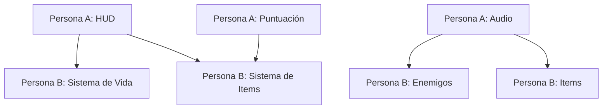

# 🎮 Top-Down Platformer Game
## Análisis del Proyecto y Plan de Implementación

---

## 📊 Estado Actual del Proyecto

### ✅ Implementado
| Componente | Descripción | Archivos |
|------------|-------------|----------|
| **Motor del Juego** | Clase principal con game loop | `Game.java` |
| **Jugador** | Animaciones, movimiento, salto | `Player.java`, `Entity.java` |
| **Mapas Tiled** | Carga y renderizado de mapas | `MapController.java` |
| **Colisiones** | Detección con el mapa | `CollisionManager.java` |
| **Cámara** | Sigue al jugador | `Playing.java` |
| **Estados del Juego** | Estructura de estados | `GameState.java`, etc. |
| **Modo Debug** | Visualización de hitboxes | `Playing.java` (F3) |
| **Assets Manager** | Carga centralizada | `Assets.java` |

### ❌ Por Implementar
| Componente | Prioridad | Asignado a |
|------------|-----------|------------|
| Sistema de Menú funcional | Alta | Persona A |
| HUD (vida, puntos) | Alta | Persona A |
| Audio (música y efectos) | Media | Persona A |
| Enemigos | Alta | Persona B |
| Sistema de daño | Alta | Persona B |
| Items/Coleccionables | Alta | Persona B |
| Múltiples niveles | Media | Persona B |
| Pantalla de pausa | Media | Persona A |
| Game Over funcional | Media | Persona A |

---

## 🏗️ Arquitectura Actual

```
src/main/java/com/jayas/topDown/
├── Game.java                 # Entry point, game loop
├── controllers/
│   ├── CollisionManager.java # Detección de colisiones
│   ├── MapController.java    # Gestión de mapas Tiled
│   └── MovementController.java # Input del jugador
├── entities/
│   ├── Entity.java           # Clase base de entidades
│   └── Player.java           # Jugador con animaciones
├── game_states/
│   ├── GameState.java        # Enum de estados
│   ├── Statemethods.java     # Interface de estados
│   ├── Playing.java          # Estado de juego principal
│   ├── Menu.java             # Menú (placeholder)
│   ├── Paused.java           # Pausa (placeholder)
│   └── GameOver.java         # Game Over (placeholder)
├── manager/
│   └── Assets.java           # Gestor de assets
└── utils/
    └── Cons.java             # Constantes del juego
```

---

## 📁 Assets Disponibles

```
assets/
├── maps/
│   └── prueba.tmx            # Mapa de prueba
├── player/                   # Sprites del jugador
│   ├── idle/
│   ├── movement/
│   ├── jump/
│   └── hit/
├── tileSet/                  # Tiles para el mapa
└── ui/                       # Elementos de interfaz
```

---

## 👥 División de Tareas

### Persona A: UI y Audio
📄 **Ver:** [README_PersonaA.md](./README_PersonaA.md)

**Responsabilidades:**
1. Menú Principal funcional
2. HUD (vida, puntos, nivel)
3. Pantalla de Pausa
4. Pantalla de Game Over
5. Sistema de Audio
6. Sistema de Puntuación

### Persona B: Gameplay
📄 **Ver:** [README_PersonaB.md](./README_PersonaB.md)

**Responsabilidades:**
1. Sistema de Enemigos
2. Sistema de Daño y Vida
3. Items y Coleccionables
4. Múltiples Niveles
5. Mejoras del Jugador
6. Spawn de Enemigos

---

## 🔄 Flujo de Dependencias



---

## 🚀 Cómo Empezar

### Ejecutar el Proyecto
```bash
./gradlew lwjgl3:run
```

### Controles Actuales
| Tecla | Acción |
|-------|--------|
| A / ← | Mover izquierda |
| D / → | Mover derecha |
| W / ↑ / Espacio | Saltar |
| F3 | Toggle modo debug |

---

## 📝 Notas Importantes

### Constantes del Juego (`Cons.java`)
```java
SCALE = 2.5f           // Escala global
GRAVITY = 0.9f         // Gravedad
PLAYER_SPEED = 5       // Velocidad del jugador
TILE_SIZE = 80px       // Tamaño de tile escalado
```

### Sistema de Colisiones
- Las colisiones se definen en Tiled en la capa "collision"
- Se cargan como objetos Rectangle
- El `CollisionManager` escala automáticamente

### Modo Debug
Presionar **F3** muestra:
- 🟢 Verde: Hitbox del jugador
- 🔴 Rojo: Rectángulos de colisión del mapa

---

## 📅 Cronograma General

| Semana | Persona A | Persona B |
|--------|-----------|-----------|
| 1 | Menú + HUD básico | Vida + Enemigo básico |
| 2 | Pausa + Audio | Items + Niveles |
| 3 | Integración y Testing | Integración y Testing |

---

## 🤝 Comunicación entre Equipos

Para evitar conflictos:
1. **Persona A** trabaja principalmente en `game_states/` y crea `ui/`
2. **Persona B** trabaja principalmente en `entities/` y crea `items/`
3. Ambos modifican `Playing.java` - coordinar cambios
4. Usar Git branches separadas y hacer merge frecuente
