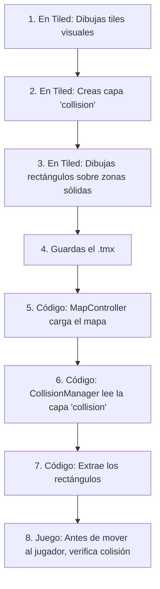

# 📐 Cómo Funcionan las Capas de Colisión en Tiled + LibGDX

## Concepto Clave

**NO comparas capas entre sí.** En su lugar, creas una **capa dedicada** para colisiones que el código lee directamente.

---

## Estructura del Mapa en Tiled

```
┌─────────────────────────────────────────┐
│              TU MAPA.TMX                │
│                                         │
│  ┌─────────────────────────────────┐    │
│  │ 📦 Capa: "tiles" (Tile Layer)   │    │  ← VISUAL: Solo para dibujar
│  │    🟫🟫🟫🟫🟫🟫🟫🟫🟫🟫🟫       │    │     El código NO lee esto
│  └─────────────────────────────────┘    │
│                                         │
│  ┌─────────────────────────────────┐    │
│  │ 🔲 Capa: "collision" (Object)   │    │  ← LÓGICA: El código LEE esto
│  │    ▭▭▭▭▭▭▭▭▭▭▭ (rectángulos)    │    │     Define zonas sólidas
│  └─────────────────────────────────┘    │
└─────────────────────────────────────────┘
```

---

## El Flujo Paso a Paso



---

## ¿Qué Lee el Código?

### En `CollisionManager.loadCollisions()`:

```java
// Busca ESPECÍFICAMENTE la capa llamada "collision"
MapLayer collisionLayer = map.getLayers().get("collision");

// Obtiene los objetos (rectángulos) de esa capa
MapObjects objects = collisionLayer.getObjects();

// Por cada rectángulo, lo guarda para verificar colisiones
for (MapObject object : objects) {
    if (object instanceof RectangleMapObject) {
        Rectangle rect = ((RectangleMapObject) object).getRectangle();
        collisionRects.add(rect);
    }
}
```

---

## Ejemplo Visual

### En Tiled verías:

| Capa de Tiles (visual) | Capa de Colisión (lógica) |
|------------------------|---------------------------|
| ![tiles]               | ![collision]              |
| Muestra gráficos       | Rectángulos invisibles    |

```
Tiles:                 Collision:
┌──────────────┐       ┌──────────────┐
│🟫🟫🟫🟫🟫🟫│       │▬▬▬▬▬▬▬▬▬▬▬▬│  ← Rectángulo techo
│              │       │              │
│    🟫🟫      │       │    ▭▭▭▭      │  ← Rectángulo plataforma
│              │       │              │
│🟫🟫🟫🟫🟫🟫│       │▬▬▬▬▬▬▬▬▬▬▬▬│  ← Rectángulo suelo
└──────────────┘       └──────────────┘
```

---

## ¿Por Qué Object Layer y No Tile Layer?

| Aspecto | Tile Layer | Object Layer ✅ |
|---------|------------|-----------------|
| Flexibilidad | Colisión = tamaño del tile | Cualquier tamaño/forma |
| Eficiencia | 1 verificación por tile | 1 verificación por zona |
| Precisión | Atada a los gráficos | Independiente de gráficos |
| Edición | Difícil de visualizar | Fácil: ves los rectángulos |

---

## Resumen

1. **Tiled**: Creas capa de objetos → dibujas rectángulos
2. **Código**: Lee esos rectángulos → los usa para detectar colisiones
3. **Resultado**: El jugador no puede atravesar las zonas marcadas
