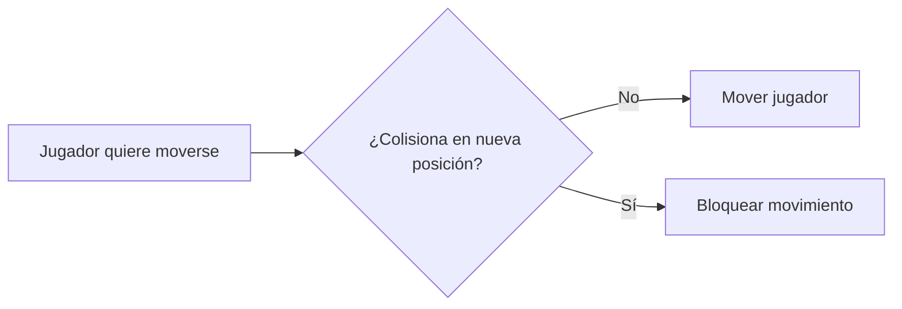

# 🎮 Guía Tutorial: Sistema de Colisiones Híbrido

Esta guía te llevará paso a paso por la implementación de un sistema de colisiones para tu juego de plataformas. Cada sección incluye el **qué**, el **por qué** y el **cómo**.

---

## 📚 Fase 0: Entendiendo la Teoría

### ¿Qué es un Hitbox?

Un **hitbox** es un rectángulo invisible que representa el área de colisión de una entidad. Es más simple que la forma real del sprite, lo que hace los cálculos de colisión mucho más rápidos.

```
┌─────────────────┐
│   Sprite 32x32  │
│  ┌───────────┐  │
│  │  Hitbox   │  │  ← El hitbox puede ser más pequeño
│  │   28x30   │  │     para mejor "game feel"
│  └───────────┘  │
└─────────────────┘
```

### ¿Por qué usar objetos de Tiled?

En lugar de marcar cada tile como "sólido" individualmente, dibujamos **rectángulos grandes** en Tiled que cubren las áreas sólidas. Esto es:
- **Más flexible**: Puedes tener colisiones que no coinciden exactamente con los tiles
- **Más eficiente**: Menos rectángulos = menos verificaciones
- **Más visual**: Ves exactamente dónde hay colisiones en el editor

### Flujo de Colisión



---

## 🧱 Fase 1: Añadir Hitbox a las Entidades

### Paso 1.1: Modificar Entity.java

**¿Por qué?** Todas las entidades (Player, futuros enemigos) necesitan un hitbox. Ponerlo en `Entity` evita duplicar código.

Añade estos campos y métodos a `Entity.java`:

```java
// --- IMPORTS NUEVOS ---
import com.badlogic.gdx.math.Rectangle;

// --- NUEVOS CAMPOS (junto a los otros campos) ---
protected Rectangle hitbox;
protected float hitboxOffsetX; // Desplazamiento del hitbox respecto al sprite
protected float hitboxOffsetY;

// --- NUEVOS MÉTODOS ---

/**
 * Inicializa el hitbox con un tamaño específico.
 * Los offsets centran el hitbox dentro del sprite.
 * 
 * @param width Ancho del hitbox en píxeles del mundo
 * @param height Alto del hitbox en píxeles del mundo
 * @param spriteWidth Ancho del sprite escalado
 * @param spriteHeight Alto del sprite escalado
 */
protected void initHitbox(float width, float height, float spriteWidth, float spriteHeight) {
    // Calcular offset para centrar el hitbox
    this.hitboxOffsetX = (spriteWidth - width) / 2f;
    this.hitboxOffsetY = (spriteHeight - height) / 2f;
    
    this.hitbox = new Rectangle(
        xPosition + hitboxOffsetX,
        yPosition + hitboxOffsetY,
        width,
        height
    );
}

/**
 * Sincroniza la posición del hitbox con la posición de la entidad.
 * IMPORTANTE: Llamar esto DESPUÉS de mover la entidad.
 */
protected void updateHitbox() {
    if (hitbox != null) {
        hitbox.setPosition(xPosition + hitboxOffsetX, yPosition + hitboxOffsetY);
    }
}

/**
 * Obtiene el hitbox para verificar colisiones.
 */
public Rectangle getHitbox() {
    return hitbox;
}
```

> [!TIP]
> **¿Por qué usar offsets?** Si el sprite mide 32x32 pero el hitbox es 28x30, los offsets centran el hitbox para que las colisiones se sientan "justas".

---

### Paso 1.2: Modificar Player.java

**¿Por qué?** El Player necesita inicializar su hitbox y actualizarlo cuando se mueve.

#### 1.2.1: En el constructor, después de `loadAnimations();`

```java
public Player(float xPosition, float yPosition) {
    super(xPosition, yPosition);
    this.animations = new ArrayList<>();
    this.textures = new ArrayList<>();
    speedJump = 15f;
    facingRight = true;
    speed = PLAYER_SPEED;

    loadAnimations();
    
    // --- NUEVO: Inicializar hitbox ---
    // Sprite es 32x32, escalado = 32 * SCALE
    // Hitbox un poco más pequeño para mejor jugabilidad
    float spriteWidth = 32 * SCALE;
    float spriteHeight = 32 * SCALE;
    float hitboxWidth = 20 * SCALE;  // Más estrecho
    float hitboxHeight = 28 * SCALE; // Casi igual de alto
    initHitbox(hitboxWidth, hitboxHeight, spriteWidth, spriteHeight);
}
```

> [!NOTE]
> **Ajusta estos valores** según cómo se sienta el juego. Un hitbox muy pequeño hace el juego "fácil", muy grande lo hace "injusto".

#### 1.2.2: Modificar updatePosition() para actualizar el hitbox

Añade al final de `updatePosition()`:

```java
public void updatePosition() {
    if (right) {
        xPosition += speed;
        facingRight = true;
    }
    if (left) {
        xPosition -= speed;
        facingRight = false;
    }
    if (jump) {
        yPosition += speedJump;
    }
    
    // --- NUEVO: Sincronizar hitbox ---
    updateHitbox();
}
```

---

## 🛠️ Fase 2: Crear CollisionManager

### Paso 2.1: Crear la clase CollisionManager.java

**¿Por qué crear una clase separada?**
- **Separación de responsabilidades**: El Player no debería saber cómo funciona el mapa
- **Reutilizable**: Enemigos, proyectiles, etc. pueden usar el mismo sistema
- **Testeable**: Puedes probar colisiones sin necesitar el juego completo

Crea un nuevo archivo en `controllers/CollisionManager.java`:

```java
package com.jayas.topDown.controllers;

import com.badlogic.gdx.maps.MapLayer;
import com.badlogic.gdx.maps.MapObject;
import com.badlogic.gdx.maps.MapObjects;
import com.badlogic.gdx.maps.objects.RectangleMapObject;
import com.badlogic.gdx.maps.tiled.TiledMap;
import com.badlogic.gdx.math.Rectangle;
import com.badlogic.gdx.utils.Array;

/**
 * Gestiona todas las colisiones del juego.
 * Carga rectángulos de colisión desde Tiled y proporciona
 * métodos para verificar colisiones.
 */
public class CollisionManager {
    
    // Array de rectángulos de colisión del mapa
    private Array<Rectangle> collisionRects;
    
    public CollisionManager() {
        collisionRects = new Array<>();
    }
    
    /**
     * Carga los objetos de colisión de una capa llamada "collision" en el mapa.
     * 
     * @param map El TiledMap cargado
     * @param unitScale La escala del mapa (misma que usas para renderizar)
     */
    public void loadCollisions(TiledMap map, float unitScale) {
        collisionRects.clear();
        
        // Buscar la capa llamada "collision"
        MapLayer collisionLayer = map.getLayers().get("collision");
        
        if (collisionLayer == null) {
            System.out.println("⚠️ AVISO: No se encontró la capa 'collision' en el mapa.");
            System.out.println("   Crea una capa de objetos en Tiled llamada 'collision'.");
            return;
        }
        
        // Obtener todos los objetos de la capa
        MapObjects objects = collisionLayer.getObjects();
        
        for (MapObject object : objects) {
            // Solo nos interesan los rectángulos
            if (object instanceof RectangleMapObject) {
                Rectangle rect = ((RectangleMapObject) object).getRectangle();
                
                // IMPORTANTE: Escalar el rectángulo
                // En Tiled los valores están en píxeles del tile,
                // pero en el juego usamos escala
                Rectangle scaledRect = new Rectangle(
                    rect.x * unitScale,
                    rect.y * unitScale,
                    rect.width * unitScale,
                    rect.height * unitScale
                );
                
                collisionRects.add(scaledRect);
            }
        }
        
        System.out.println("✓ Cargados " + collisionRects.size + " rectángulos de colisión.");
    }
    
    /**
     * Verifica si un hitbox colisiona con algún rectángulo del mapa.
     * 
     * @param hitbox El rectángulo a verificar (ej: hitbox del jugador)
     * @return true si hay colisión, false si no
     */
    public boolean checkMapCollision(Rectangle hitbox) {
        for (Rectangle rect : collisionRects) {
            if (hitbox.overlaps(rect)) {
                return true; // ¡Hay colisión!
            }
        }
        return false; // No hay colisión
    }
    
    /**
     * Verifica colisión entre dos entidades.
     * 
     * @param a Hitbox de la primera entidad
     * @param b Hitbox de la segunda entidad
     * @return true si colisionan
     */
    public boolean checkEntityCollision(Rectangle a, Rectangle b) {
        return a.overlaps(b);
    }
    
    /**
     * Obtiene los rectángulos de colisión (útil para debug).
     */
    public Array<Rectangle> getCollisionRects() {
        return collisionRects;
    }
}
```

> [!IMPORTANT]
> **¿Por qué escalar los rectángulos?** En Tiled, un tile de 32x32 siempre es 32x32 píxeles. Pero en tu juego usas `SCALE = 2.5f`, así que un tile ocupa 80x80 píxeles en pantalla. Los rectángulos deben escalarse igual.

---

### Paso 2.2: Integrar CollisionManager en MapController

**¿Por qué aquí?** El `MapController` ya carga el mapa, tiene sentido que también cargue las colisiones.

Modifica `MapController.java`:

```java
// --- NUEVO IMPORT ---
// (al principio del archivo)

// --- NUEVO CAMPO ---
private CollisionManager collisionManager;

// --- MODIFICAR CONSTRUCTOR ---
public MapController() {
    mapLoader = new TmxMapLoader();
    collisionManager = new CollisionManager(); // NUEVO
}

// --- MODIFICAR loadMap() ---
public void loadMap(String mapPath) {
    if (map != null) {
        // dispose del mapa anterior si existe
    } 
    if (renderer != null) {
        renderer.dispose();
    }
    
    map = mapLoader.load(mapPath);
    renderer = new OrthogonalTiledMapRenderer(map, UNIT_SCALE);
    
    // --- NUEVO: Cargar colisiones ---
    collisionManager.loadCollisions(map, UNIT_SCALE);
}

// --- NUEVO GETTER ---
public CollisionManager getCollisionManager() {
    return collisionManager;
}
```

---

## 🗺️ Fase 3: Configurar Tiled

### Paso 3.1: Abrir tu mapa en Tiled

Abre `assets/maps/prueba.tmx` en Tiled.

### Paso 3.2: Crear la capa de objetos

1. En el panel **Capas** (derecha), haz clic en el botón **"Nueva Capa"** → **"Capa de Objetos"**
2. Nombra la capa exactamente: `collision` (en minúsculas)


### Paso 3.3: Dibujar rectángulos de colisión

1. Selecciona la capa `collision`
2. Usa la herramienta **Rectángulo** (atajo: `R`)
3. Dibuja rectángulos sobre las plataformas y paredes

```
Ejemplo visual de tu mapa:

Tiles:          Capa collision:
┌──────────┐    ┌──────────┐
│▓▓▓▓▓▓▓▓▓▓│    │██████████│  ← Rectángulo arriba
│          │    │          │
│   ▓▓▓▓   │    │   ████   │  ← Rectángulo plataforma
│          │    │          │
│▓▓▓▓▓▓▓▓▓▓│    │██████████│  ← Rectángulo suelo
└──────────┘    └──────────┘
```

> [!TIP]
> **Consejo**: Haz los rectángulos un poco más pequeños que las plataformas visuales. Esto hace que el jugador pueda "asomarse" al borde sin caer, lo cual se siente mejor.

### Paso 3.4: Guardar el mapa

Guarda con `Ctrl+S`. El archivo `.tmx` ahora incluirá la capa de objetos.

---

## 🔄 Fase 4: Integrar Colisiones en el Movimiento

### Paso 4.1: Modificar Player para verificar colisiones

**¿Por qué verificar ANTES de moverse?** Si movermos primero y luego detectamos colisión, el jugador ya está "dentro" del obstáculo y es difícil sacarlo.

Modifica `Player.java`:

```java
// --- NUEVO IMPORT ---
import com.jayas.topDown.controllers.CollisionManager;

// --- MODIFICAR updatePosition() ---
// Cambia la firma para recibir el CollisionManager
public void updatePosition(CollisionManager collisionManager) {
    float nextX = xPosition;
    float nextY = yPosition;
    
    // Calcular siguiente posición
    if (right) {
        nextX += speed;
        facingRight = true;
    }
    if (left) {
        nextX -= speed;
        facingRight = false;
    }
    if (jump) {
        nextY += speedJump;
    }
    
    // --- VERIFICAR COLISIÓN HORIZONTAL ---
    // Crear hitbox temporal en la nueva posición X
    Rectangle testHitbox = new Rectangle(hitbox);
    testHitbox.setPosition(nextX + hitboxOffsetX, yPosition + hitboxOffsetY);
    
    if (!collisionManager.checkMapCollision(testHitbox)) {
        // No hay colisión, podemos movernos
        xPosition = nextX;
    }
    // Si hay colisión, simplemente no nos movemos (xPosition no cambia)
    
    // --- VERIFICAR COLISIÓN VERTICAL ---
    testHitbox.setPosition(xPosition + hitboxOffsetX, nextY + hitboxOffsetY);
    
    if (!collisionManager.checkMapCollision(testHitbox)) {
        yPosition = nextY;
    }
    
    // Sincronizar hitbox con posición final
    updateHitbox();
}
```

> [!IMPORTANT]
> **¿Por qué separar horizontal y vertical?** Si el jugador se mueve en diagonal y hay una pared, queremos que pueda "deslizarse" por la pared (moverse en el eje que no colisiona).

### Paso 4.2: Modificar update() en Player

También necesitas cambiar el método `update()`:

```java
// --- MODIFICAR update() ---
// Cambia la firma para recibir el CollisionManager
public void update(float deltaTime, CollisionManager collisionManager) {
    updateAnimation();
    updatePosition(collisionManager);  // Pasar collisionManager
    stateTime += deltaTime;
}
```

---

### Paso 4.3: Modificar Playing.java

Ahora necesitas pasar el `CollisionManager` al Player:

```java
@Override
public void update(float delta) {
    // --- MODIFICADO: Pasar CollisionManager al update ---
    player.update(delta, mapController.getCollisionManager());
    
    camera.position.x = player.getxPosition();
    camera.update();
}
```

---

## 🔍 Fase 5: Modo Debug Visual

### ¿Por qué modo debug?

Ver los hitboxes y rectángulos de colisión es **esencial** para:
- Encontrar por qué el jugador "atraviesa" una plataforma
- Ajustar el tamaño del hitbox
- Ver si olvidaste dibujar algún rectángulo de colisión

### Paso 5.1: Añadir ShapeRenderer a Playing

El `ShapeRenderer` de LibGDX permite dibujar formas geométricas (rectángulos, líneas, etc.).

En `Playing.java`:

```java
// --- NUEVOS IMPORTS ---
import com.badlogic.gdx.graphics.glutils.ShapeRenderer;
import com.badlogic.gdx.graphics.Color;
import com.badlogic.gdx.Input.Keys;

// --- NUEVOS CAMPOS ---
private ShapeRenderer shapeRenderer;
private boolean debugMode = false; // Toggle con F3

// --- EN initClasses(), al final ---
shapeRenderer = new ShapeRenderer();

// --- NUEVO MÉTODO para toggle debug ---
public void toggleDebug() {
    debugMode = !debugMode;
    System.out.println("Debug mode: " + (debugMode ? "ON" : "OFF"));
}

// --- EN update(), añadir al principio ---
@Override
public void update(float delta) {
    // Toggle debug con F3
    if (Gdx.input.isKeyJustPressed(Keys.F3)) {
        toggleDebug();
    }
    
    player.update(delta, mapController.getCollisionManager());
    camera.position.x = player.getxPosition();
    camera.update();
}

// --- NUEVO MÉTODO para renderizar debug ---
public void renderDebug() {
    if (!debugMode) return;
    
    shapeRenderer.setProjectionMatrix(camera.combined);
    shapeRenderer.begin(ShapeRenderer.ShapeType.Line);
    
    // Dibujar rectángulos de colisión del mapa (ROJO)
    shapeRenderer.setColor(Color.RED);
    for (Rectangle rect : mapController.getCollisionManager().getCollisionRects()) {
        shapeRenderer.rect(rect.x, rect.y, rect.width, rect.height);
    }
    
    // Dibujar hitbox del jugador (VERDE)
    shapeRenderer.setColor(Color.GREEN);
    Rectangle playerHitbox = player.getHitbox();
    if (playerHitbox != null) {
        shapeRenderer.rect(playerHitbox.x, playerHitbox.y, 
                          playerHitbox.width, playerHitbox.height);
    }
    
    shapeRenderer.end();
}

// --- EN dispose() ---
@Override
public void dispose() {
    background.dispose();
    player.dispose();
    shapeRenderer.dispose(); // NUEVO
}
```

### Paso 5.2: Llamar a renderDebug desde Game.java

En `Game.java`, después de renderizar el estado de juego:

```java
private void draw() {
    ScreenUtils.clear(0.15f, 0.15f, 0.2f, 1f);

    batch.begin();
    switch (GameState.state) {
        case PLAYING:
            playing.render(batch);
            if (GameState.state == GameState.PLAYING) {
                playing.renderMap();
            }
            break;
        // ... otros casos
    }
    batch.end();
    
    // --- NUEVO: Renderizar debug DESPUÉS de cerrar el batch ---
    if (GameState.state == GameState.PLAYING) {
        playing.renderDebug();
    }
}
```

> [!WARNING]
> **El ShapeRenderer debe usarse FUERA del SpriteBatch**. Por eso lo llamamos después de `batch.end()`.

---

## ✅ Fase 6: Verificación

### Lista de comprobación

- [ ] Ejecuta el juego con `./gradlew lwjgl3:run`
- [ ] Presiona **F3** para activar el modo debug
- [ ] Deberías ver:
  - 🟩 Rectángulo verde = hitbox del jugador
  - 🟥 Rectángulos rojos = áreas de colisión del mapa
- [ ] Mueve el jugador hacia una plataforma
- [ ] El jugador debe **detenerse** al tocar el rectángulo rojo
- [ ] Si atraviesa la plataforma, revisa:
  - ¿Dibujaste el rectángulo en Tiled?
  - ¿La capa se llama exactamente `collision`?
  - ¿Guardaste el mapa en Tiled?

### Solución de problemas comunes

| Problema | Causa probable | Solución |
|----------|----------------|----------|
| No se ven rectángulos rojos | Capa no se llama "collision" | Verificar nombre exacto en Tiled |
| Jugador atraviesa paredes | Velocidad muy alta | Reducir `PLAYER_SPEED` o usar detección continua |
| Hitbox no se mueve | Olvidaste `updateHitbox()` | Verificar que se llama en `updatePosition()` |
| Colisiones "flotan" | Escala incorrecta | Verificar `UNIT_SCALE` en MapController |

---

## 🚀 Siguientes pasos (opcional)

Una vez funcione el sistema básico, puedes expandirlo:

1. **Gravedad**: Aplica velocidad Y negativa constante
2. **Detección de suelo**: ¿Está el jugador pisando algo? (para permitir salto)
3. **Plataformas de un solo sentido**: Puedes atravesarlas desde abajo
4. **Detección continua**: Para velocidades altas, verificar en pasos pequeños

¡Buena suerte con la implementación! 🎮
